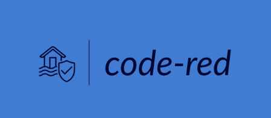

# Disaster Management Bot

## Table of Contents
- [Introduction](#introduction)
- [Features](#features)
- [Installation](#installation)
- [Usage](#usage)
- [Conversations](#conversations)
- [Contributing](#contributing)
- [License](#license)

## Introduction

The Disaster Management Bot is an AI-powered virtual assistant designed to provide critical information and guidance during emergency situations, such as floods, to help people make informed decisions for their safety and survival.

During natural disasters, immediate access to information can be a matter of life and death. This bot aims to bridge that gap by offering real-time assistance and guidance.

## Features

- Real-time disaster information and guidance.
- Quick and concise responses.
- Emergency rescue measures.
- Survival guide.
- User-friendly interaction via WhatsApp.

## Installation

To run the Disaster Management Bot, follow these steps:

1. Clone this repository to your local machine.
2. Install the required dependencies using `npm install`.
3. Set up the necessary environment variables, including WhatsApp token, OpenAI API key, and other configuration options.
4. Start the server using `npm start`.

## Usage

To use the Disaster Management Bot, send a WhatsApp message with a specific keyword or question related to disaster management. The bot will provide you with relevant information and guidance instantly.

## Conversations

Here are some example conversations that illustrate how the bot responds to user queries:

- [How to find higher ground during a flood?](conversations/conversation1.md)
- [What if I can't find higher ground?](conversations/conversation2.md)
- [How can I signal for help with bright clothing or a flashlight?](conversations/conversation3.md)

## Contributing

Contributions are welcome! Whether you want to improve the bot's responses, add new features, or fix bugs, please feel free to open a pull request. For major changes, please open an issue first to discuss what you would like to change.

## License

This project is licensed under the MIT License - see the [LICENSE](LICENSE) file for details.
